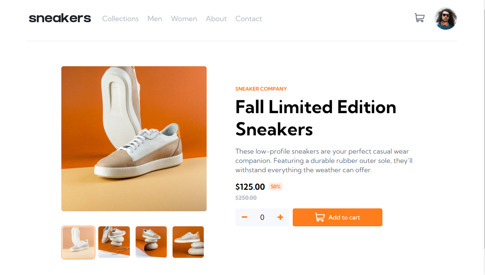

# Frontend Mentor - E-commerce product page solution

This is a solution to the [E-commerce product page challenge on Frontend Mentor](https://www.frontendmentor.io/challenges/ecommerce-product-page-UPsZ9MJp6). Frontend Mentor challenges help you improve your coding skills by building realistic projects.

This is a [Next.js](https://nextjs.org/) project bootstrapped with [`create-next-app`](https://github.com/vercel/next.js/tree/canary/packages/create-next-app).

## Getting Started

First, run the development server:

```bash
npm run dev
# or
yarn dev
```

Open [http://localhost:3000](http://localhost:3000) with your browser to see the result.

## Table of contents

- [The challenge](#the-challenge)
- [Screenshot](#screenshot)
- [Links](#links)
- [My process](#my-process)
  - [Built with](#built-with)
  - [What I learned](#what-i-learned)
  - [Continued development](#continued-development)
- [Author](#author)

### The challenge

Users should be able to:

- View the optimal layout for the site depending on their device's screen size
- See hover states for all interactive elements on the page
- Open a lightbox gallery by clicking on the large product image
- Switch the large product image by clicking on the small thumbnail images
- Add items to the cart
- View the cart and remove items from it

### Screenshot



### Links

- Solution URL:[https://github.com/Iykekelvins/ecommerce-product-page]
- Live Site URL: [https://ecommerce-product-iyke.netlify.app/]

## My process

I first started out the project by using npx-create-next-app. I created a folder for my components, assets and styles. I installed sass as well.
I built out the product page first, then the image switching functionality. I built the product counter next, and also implemented the cart functionality. I finished up with making the page responsive, and adding mobile navigation.

### Built with

- Semantic HTML5 markup
- SCSS
- [React](https://reactjs.org/) - JS library
- [Next.js](https://nextjs.org/) - React framework

### What I learned

I learned how to display different content with the same component by passing props.

### Continued development

I'd be looking to learn more about state management with Context API and useReducer.

## Author

- Frontend Mentor - [@iykekelvins](https://www.frontendmentor.io/profile/iykekelvins)
- Twitter - [@iykekelvins](https://www.twitter.com/iykekelvins)
